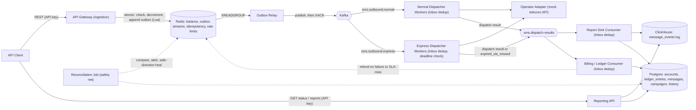

# SMS Gateway - Architecture

Status: **v1 - approved design, pre-implementation.**

## 1. Overview

A multi-tenant SMS Gateway: tenants (businesses) send SMS to any phone number via a REST API, must maintain a prepaid credit balance to do so, and can retrieve delivery reports for single messages and bulk campaigns. The system is designed for ~100M messages/day with highly skewed per-tenant traffic, and offers a premium "Express" lane with a hard delivery-time SLA (e.g. for OTP codes).

This document is the source of truth for the system design. It intentionally favors a **lean, horizontally-scalable Docker Compose build** over a fully productionized deployment - every component is designed so it *can* scale to the target numbers, without us building out the full production operational surface (multi-broker Kafka, replicated Postgres, etc.) up front.

## 2. Requirements

- Send SMS to any number via REST API; view reports of sent messages.
- Every tenant has a limited credit/balance; must top up before sending; must be able to spend it down to **exactly zero**, never negative.
- Scale target: tens of thousands of businesses, ~100M messages/day (~1,160/sec average, highly bursty/skewed across tenants).
- **Express** lane for time-sensitive messages (e.g. OTP) with a guaranteed delivery-time SLA to the operator.
- No auth/user-management system required (see section 10 for how tenant identity is still handled safely).
- English/Persian priced the same; all messages are single-segment.
- REST API only, no UI.
- Go preferred.

## 3. Key architectural decisions

| Decision | Choice | Why |
|---|---|---|
| Message broker | **Kafka** | Durable buffering, independent consumer groups per concern (dispatch/billing/reporting), replay, partition-based tenant isolation at 100M/day scale. |
| Language | **Go** | Matches the brief's stated preference; strong concurrency primitives for high-throughput I/O-bound services. |
| Balance store | **Redis** (atomic Lua) | Sub-millisecond atomic check-and-decrement under massive concurrency; see section 5. |
| System of record | **PostgreSQL** | Strong consistency for accounts, credit ledger, message/campaign state and history. |
| Reporting store | **ClickHouse** | Purpose-built for high-ingest, aggregation-heavy "give me my report" queries at 100M-rows/day scale (CQRS read side). |
| Postgres tooling | `pgx` + `sqlc` + `golang-migrate` | Compile-time-checked SQL, zero ORM/reflection overhead, full control over query shape. No GORM. |
| Consistency mechanism | **Outbox (Redis Streams) + Inbox pattern** | See section 5 - solves the "hot-path store and durable store can drift" problem without relying on fragile reconciliation. |

## 4. High-level architecture (single-message flow)



Binaries (`cmd/`): `api-gateway`, `outbox-relay`, `campaign-expander`, `dispatcher` (`--mode=normal|express`), `report-sink`, `billing-consumer`, `reconciler`, `reporting-api`, `operator-mock`.

## 5. Reliability backbone: Outbox + Inbox

**The problem:** the API Gateway's hot-path balance decrement lives in Redis (for atomic, sub-millisecond concurrency control), while the durable system of record is Postgres, and the dispatch pipeline runs through Kafka. If these were three independent writes, a crash between them could create a permanent gap - a debit with no record of what it paid for, or a message accepted but never dispatched. A periodic "compare Redis to Postgres and fix" reconciliation job cannot safely close this gap on its own: it can hand back credit that was already legitimately spent (a free-money bug) just as easily as it can catch a real drift.

**The fix:** make the decrement and "the event to propagate" a single atomic operation, then guarantee retried, eventual delivery of that event. Reconciliation becomes a safety net, never the primary sync mechanism.

### 5.1 Outbox (write side)

The API Gateway's Lua script does two things atomically, in one indivisible Redis operation:

1. `if balance >= cost: balance -= cost else return INSUFFICIENT_FUNDS`
2. On success: `XADD outbox:messages * account_id ... message_id ... to ... priority ... cost ... deadline ...` (a Redis Stream entry, in the **same** script execution).

Because both happen atomically, it is impossible to decrement the balance without durably recording why. The debit can be *delayed* downstream, never silently lost.

**Why a Redis Stream *alongside* Kafka** (not instead of it): these solve different problems. Kafka is the durable backbone for everything downstream of acceptance (dispatch, billing, reporting fan-out) and is deliberately kept out of the synchronous request path. Redis Streams' only job is to be the tiny atomic staging log between the synchronous balance decrement and Kafka.

- It has to live **in Redis**, co-located with `balance`, to get atomicity with the decrement via one Lua script. The classic transactional-outbox pattern writes to the same Postgres transaction as the business row - but `balance` intentionally isn't in Postgres on the hot path, so the outbox medium must be wherever the atomic decrement happens.
- Publishing to Kafka synchronously from the request would reintroduce a dual-write across two different systems, and make Kafka a hard dependency on the hot path (worse p99, and a Kafka blip fails all sends even though balance logic is fine).
- Among Redis data structures, a **Stream** (not a List/Set) gives an outbox relay exactly the semantics it needs natively: consumer groups, per-entry `XACK`, and `XAUTOCLAIM`/`XCLAIM` to reclaim entries from a crashed consumer - a List would require hand-rolling all of that.
- It's a deliberately short-lived staging buffer, not a Kafka replacement - Kafka remains the backbone for throughput/retention/fan-out at 100M/day scale.

`cmd/outbox-relay` consumes `outbox:messages` (and `outbox:campaigns`) via a Redis Streams consumer group, publishes to the right Kafka topic with an idempotent producer, and only `XACK`s after Kafka confirms. A crash-and-retry can cause a duplicate publish - safe, because every downstream consumer is idempotent (Inbox, below). The billing consumer subscribes to this same accepted-event stream, so the durable ledger debit entry is *guaranteed* to eventually exist.

### 5.2 Inbox (read side)

Kafka is at-least-once, so every consumer (`dispatcher`, `report-sink`, `billing-consumer`, `campaign-expander`) can see the same message more than once. Each keeps an Inbox/dedup check before any side effect: a Postgres table `processed_events(consumer_name, event_id, processed_at)` with a unique constraint on `(consumer_name, event_id)`, checked-or-inserted in the same transaction as the business write. Duplicate delivery becomes safe by construction (never double-charge, never double-send).

### 5.3 What reconciliation is for

`cmd/reconciler` runs periodically to **detect and alert**, only auto-healing in the safe direction:

- Redis balance **higher** than `SUM(ledger_entries)` -> auto-correct down immediately + page (dangerous "free credit" direction).
- Redis balance **lower** than the ledger sum -> alert only, don't blindly increase (expected-lag direction; blind auto-heal could mask a real bug).
- On a cold Redis start, the only legitimate way to seed `balance:{account_id}` is `SUM(ledger_entries)` from Postgres - Postgres is the ultimate source of truth for balance.
- Redis runs with AOF persistence (`appendfsync everysec` minimum) so a normal restart doesn't even trigger this path.

## 6. Event history & auditability

Every important entity has a current-state table **and** a companion append-only history (a lightweight audit-trail style, not strict event sourcing):

- **Balance/credit:** `ledger_entries` (topup/debit/refund, immutable) is inherently event-sourced; `accounts.balance` is a denormalized cache updated in the same transaction as each ledger insert.
- **Message lifecycle:** `messages` holds current status; `message_status_events` (Postgres, append-only) records every transition. The same lifecycle events flow into ClickHouse `message_events` for large-scale analytics.
- **Campaigns:** `campaigns` holds current aggregate status; per-recipient `messages` rows carry their own history; campaign aggregates are computed on read.
- **Outbox entries** are themselves an event log of every accepted send/debit.

## 7. Express SLA policy - drop if useless

Delivering an Express message after its usefulness window (e.g. an OTP) is worse than not sending it, since the cost was spent for nothing.

- Every Express message carries a hard deadline = `accepted_at + 2 minutes` (see targets below), set when the outbox entry is created.
- The Express Dispatcher checks the deadline immediately before calling the Operator Adapter (not just at enqueue time): past deadline -> do not call the operator, mark `expired_sla_missed`.
- The Billing Consumer treats `expired_sla_missed` exactly like a dispatch failure: automatic refund.
- **Tier 1 (target/advertised SLA, used for alerting and sizing the dedicated Express pool): 95% dispatched within 1 minute.**
- **Tier 2 (hard ceiling, used for the auto-drop rule): 99.9% dispatched within 2 minutes.**
- Normal-priority messages have no such deadline.
- **Campaigns never use the Express lane** - see section 9.

## 8. Component breakdown

- **API Gateway** (`cmd/api-gateway`): REST entry point. Resolves `account_id` from the API key only (never client input). Runs the Lua accept script for `/v1/messages` and `/v1/campaigns`. Per-tenant token-bucket rate limiting at ingestion (independent of balance).
- **Outbox Relay** (`cmd/outbox-relay`): drains Redis outbox streams into Kafka reliably.
- **Dispatcher** (`cmd/dispatcher --mode=normal|express`): Inbox-dedup, calls the Operator Adapter, retries with backoff, enforces the Express deadline.
- **Report Sink** (`cmd/report-sink`): Inbox-dedup, updates `messages`/`message_status_events` (Postgres) and `message_events` (ClickHouse).
- **Billing / Ledger Consumer** (`cmd/billing-consumer`): Inbox-dedup, writes ledger debit/refund entries.
- **Reconciler** (`cmd/reconciler`): safety-net drift detection/alerting (section 5.3).
- **Campaign Expander** (`cmd/campaign-expander`): fans an accepted campaign out into individual messages (section 9).
- **Reporting API** (`cmd/reporting-api`): serves `/v1/messages/{id}`, `/v1/reports`, `/v1/campaigns/*`.
- **Operator Mock** (`cmd/operator-mock`): simulates a telecom operator (latency + configurable failure rate) - there is no real operator integration in this build.

### Kafka topics

- `sms.outbound.normal` - partitioned (e.g. 32-64 partitions) by `hash(account_id)`; a bursty tenant only saturates *their* partition(s) - the core noisy-neighbor mitigation.
- `sms.outbound.express` - separate topic + dedicated, over-provisioned consumer pool so lag stays ~0.
- `sms.dispatch-results` - consumed independently by Report Sink and Billing Consumer.
- `sms.dlq` - messages that exhaust retries.

## 9. Batch sending: Campaigns

A campaign = one message body sent to many recipients in a single request.

**Campaigns are always normal priority - Express is not available for campaigns.** Express capacity is deliberately small and dedicated to guarantee a tight per-message SLA for time-sensitive single sends (OTPs); letting a large campaign into that lane would force massive over-provisioning or break the SLA for real Express traffic.

**Accept flow** (`POST /v1/campaigns { text, recipients: [...] }`, capped at 10,000 recipients/request to keep the Redis Lua critical section short):

1. Validate every recipient number.
2. `total_cost = cost_per_message * len(recipients)`.
3. One Lua call: check `balance >= total_cost`, decrement once, `XADD outbox:campaigns` with the recipient list.
4. **Insufficient balance -> all-or-nothing**: reject the entire campaign with `402` and the exact shortfall; no partial sends.
5. Return `202 Accepted` immediately.

**Campaign Expander** (`cmd/campaign-expander`) consumes `outbox:campaigns`:

1. Generates a deterministic per-recipient `message_id = hash(campaign_id, recipient_index)` - this is what makes expansion safely retryable.
2. Bulk-inserts the `campaigns` row and all `messages` rows in one transaction via `INSERT ... ON CONFLICT (id) DO NOTHING`.
3. Publishes one event per recipient to `sms.outbound.normal` **only**, using the same `hash(account_id)` partitioning.
4. `XACK`s the campaign outbox entry only once all of the above succeeds.

From there, dispatch/billing/reporting work exactly as for a single message, carrying a `campaign_id` field. Refunds on failure/expiry are per-recipient-message.

**Campaign reporting:** `GET /v1/reports?campaignId=...` for per-message listing; `GET /v1/campaigns/{id}/report` for an aggregate view (`totalRecipients, sent, failed, expiredSlaMissed, pending, totalCost, refundedAmount`).

## 10. REST API surface (v1)

Tenant identity is **always** resolved server-side from the API key (`Authorization: Bearer <apiKey>`); never accepted as a path/query/body parameter. Cross-tenant lookups return `404` (not `403`) to avoid leaking existence of another tenant's resources.

Recipient phone numbers (`to`) accept both E.164 (`+989121234567`) and local Iranian mobile format (`09121234567`); local numbers are normalized to E.164 internally.

| Method & path | Auth | Notes |
|---|---|---|
| `POST /v1/accounts` | none (open, rate-limited) | `{ name }` -> `{ accountId, apiKey }` |
| `POST /v1/topups` | API key | `{ amount }` -> `{ balance }` |
| `GET /v1/balance` | API key | -> `{ balance }` |
| `POST /v1/messages` | API key + `Idempotency-Key` | `{ to, text, priority }` -> `{ messageId, status, cost }`; `priority`: `normal｜express` |
| `GET /v1/messages/{id}` | API key | 404 if not found/not owned |
| `POST /v1/campaigns` | API key + `Idempotency-Key` | `{ text, recipients: [...] }` -> `{ campaignId, totalRecipients, cost }` (always normal priority) |
| `GET /v1/campaigns` | API key | paginated list |
| `GET /v1/campaigns/{id}` | API key | summary/status |
| `GET /v1/campaigns/{id}/report` | API key | aggregate report |
| `GET /v1/reports?campaignId=&from=&to=&status=&page=` | API key | paginated, scoped to caller |

See [`openapi/openapi.yaml`](openapi/openapi.yaml) for the full machine-readable contract.

## 11. Data model

**Postgres** (all tables include `created_at`, `updated_at`):

- `accounts(id, api_key_hash, name, balance, created_at, updated_at)`
- `ledger_entries(id, account_id, type[topup|debit|refund], amount, message_id nullable, created_at, updated_at)`
- `campaigns(id, account_id, text, total_recipients, cost_per_message, total_cost, status, created_at, updated_at)`
- `messages(id, account_id, campaign_id nullable, recipient, priority, cost, status, operator, deadline_at nullable, created_at, updated_at, dispatched_at)`
- `message_status_events(id, message_id, status, occurred_at, created_at, updated_at)`
- `processed_events(consumer_name, event_id, processed_at, created_at)`

**Redis:** `balance:{account_id}`, `outbox:messages`, `outbox:campaigns`, `idem:{account_id}:{idempotency_key}`, `ratelimit:{account_id}`.

**ClickHouse:** `message_events(event_time, message_id, account_id, campaign_id nullable, recipient, priority, status, cost, operator)`.

See [`db/migrations/`](db/migrations) for the executable schema and [`clickhouse/init/`](clickhouse/init) for the ClickHouse table definition.

## 12. Tech stack

- **HTTP:** `chi`
- **Postgres:** `jackc/pgx` (driver/pool) + `sqlc` (compile-time typed queries) + `golang-migrate` (migrations). No GORM.
- **Kafka:** `segmentio/kafka-go`
- **Redis:** `redis/go-redis`
- **ClickHouse:** `ClickHouse/clickhouse-go`
- **Logging:** `zap`; **metrics:** Prometheus; **tracing:** OpenTelemetry (optional)

## 13. Cross-cutting concerns

- **Idempotency:** `Idempotency-Key` header on `/v1/messages` and `/v1/campaigns`, deduped via Redis; internal Inbox tables for consumer-side dedup.
- **Retries/DLQ:** exponential backoff in dispatchers; `sms.dlq` for exhausted retries.
- **Observability:** per-topic consumer lag, per-tenant rate, Express SLA latency histograms by tier, campaign expansion throughput; structured logs correlated by `message_id`/`campaign_id`.
- **Multi-operator routing:** pluggable `OperatorAdapter` interface + simple `Router` (stretch goal); one mock operator for the core build.
- **Local/dev deployment:** single `docker-compose.yml` (see below).

## 14. Local development

```bash
docker compose up -d          # Postgres, Redis, Kafka (KRaft), ClickHouse, operator-mock
make migrate-up                # apply Postgres migrations
make sqlc                      # regenerate typed queries
make run-api-gateway            # etc. - see Makefile for all cmd/ targets
```

See the [README](README.md) for details, and [AGENTS.md](AGENTS.md) for repo conventions when working on this codebase with an AI agent.

## 15. Explicitly out of scope (for this build)

- Real telecom operator integration (mocked instead).
- Multi-broker Kafka / replicated Postgres / ClickHouse cluster / Redis replicas (documented as production hardening, not built).
- Per-recipient message personalization/templating in campaigns.
- Any GUI.
