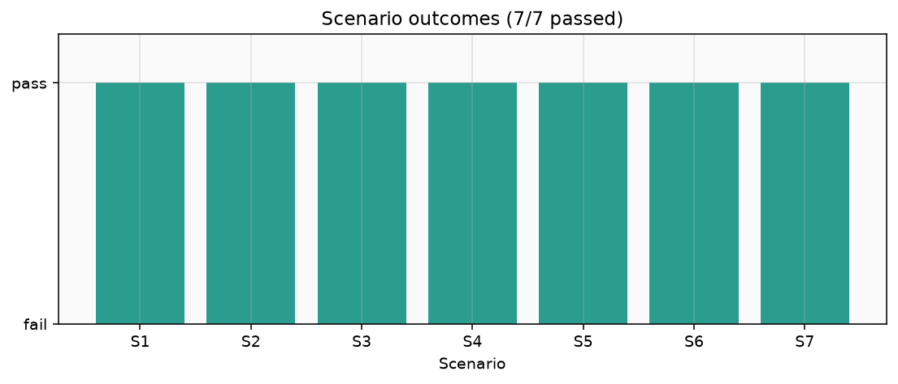
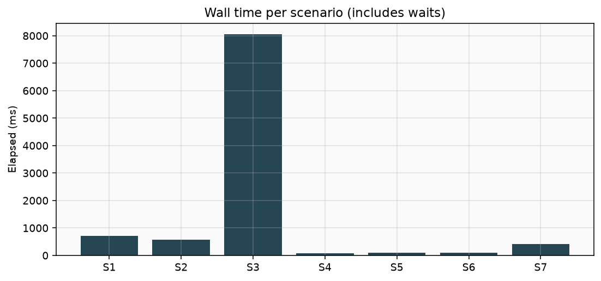
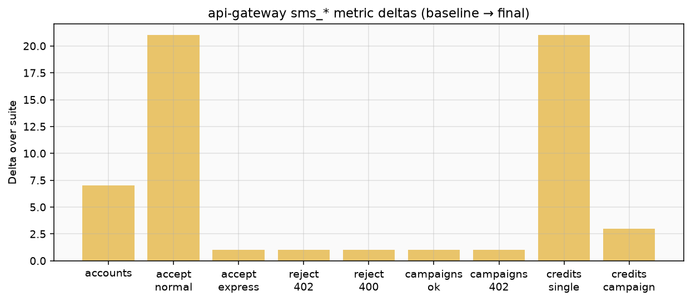
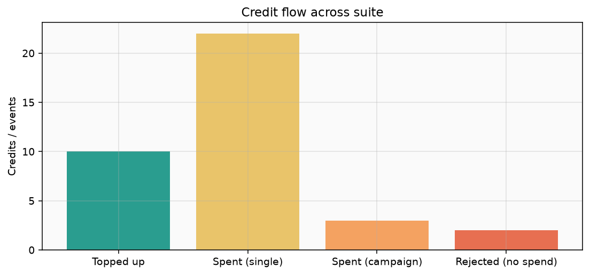
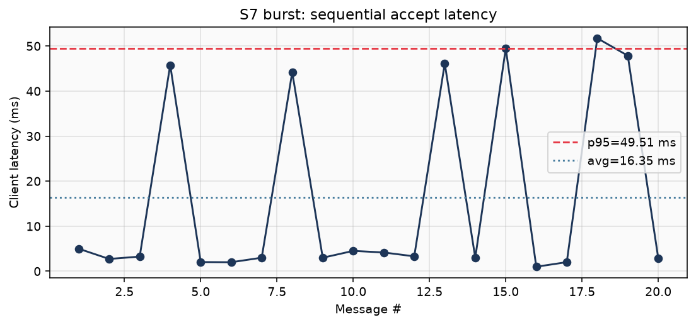
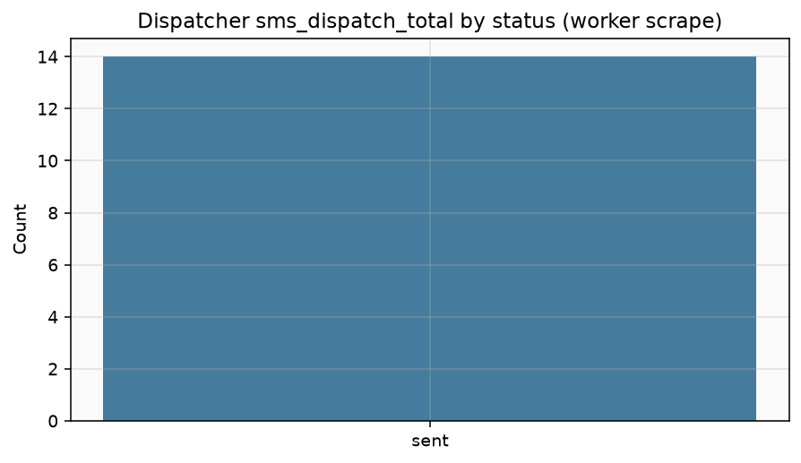

# Scenario Report — End-to-End Flows

**Runner:** [`scripts/run-scenario-suite.ps1`](../scripts/run-scenario-suite.ps1)  
**Charts:** [`scripts/generate-scenario-charts.py`](../scripts/generate-scenario-charts.py)  
**Raw data:** [`docs/scenario-report/results.json`](scenario-report/results.json)  
**Date:** 2026-07-24  
**Result:** **7 / 7 passed** in ~14.4 s wall time

This report exercises happy paths, billing rejects, validation, and a small accept burst against the local Docker Compose stack. It is a **correctness / instrumentation** suite, not a capacity proof (see [trade-offs](trade-offs.md) and the [load-test report](load-test-report.md)).

## Environment

| Item | Value |
|---|---|
| Host OS | Windows 10 / 11 |
| Runtime | Docker Compose (full SMS Gateway stack) |
| API | `http://[::1]:8080` (see host note below) |
| Reporting API | `http://[::1]:8081` |
| Metrics | Prometheus text on api-gateway `/metrics` + worker `METRICS_ADDR` scrapes |

### Host note (port 8080)

On this machine, Adobe Connect binds `127.0.0.1:8080`, so IPv4 `localhost:8080` does not reach the gateway. The suite uses **IPv6 loopback** `http://[::1]:8080`, which maps to the Compose-published port.

## Suite summary



| ID | Scenario | Elapsed | Outcome |
|---|---|---:|---|
| S1 | Normal single-message happy path | 718 ms | `accepted` → `sent`, balance 10 → 9 |
| S2 | Express single-message happy path | 571 ms | `accepted` → `sent` |
| S3 | Campaign AoN happy path (3 recipients) | 8051 ms | report `sent:3`, balance 10 → 7 |
| S4 | Insufficient funds (single) | 69 ms | HTTP **402**, balance 0 |
| S5 | Campaign AoN reject | 105 ms | HTTP **402**, balance stays 1 |
| S6 | Validation reject (bad phone) | 102 ms | HTTP **400**, balance unchanged |
| S7 | Burst accept (20 sequential) | 406 ms | 20×202, avg ~16 ms, p95 ~49.5 ms |



S3 dominates wall time because the runner waits for campaign expansion + dispatch + report aggregation to settle before asserting the campaign report.

## Credit and accept metrics

Suite-level deltas on api-gateway `sms_*` counters (baseline scrape → final scrape):

| Metric (suite delta) | Value |
|---|---:|
| Accounts created | 7 |
| Messages accepted (normal) | 21 |
| Messages accepted (express) | 1 |
| Campaigns accepted | 1 |
| Messages rejected (402) | 1 |
| Campaigns rejected (402) | 1 |
| Messages rejected (400) | 1 |
| Credits spent (single normal) | 21 |
| Credits spent (campaign) | 3 |
| Topup credits | 81 |





Notes:

- Topups cover per-scenario account funding (10+5+10+0+1+5+50 ≈ 81).
- Single-message spends include S1 + S7 (1 + 20); express spend is counted separately in worker ledger metrics.
- Reject paths (S4/S5/S6) do not decrement balance.

## Scenario detail

### S1 — Normal happy path

Create account → topup **10** → `POST /v1/messages` (normal) → poll until terminal status.

| Check | Observed |
|---|---|
| Accept | `accepted` |
| Final status | `sent` |
| Operator | `mci` (mock) |
| Balance after | **9** |
| Gateway deltas | `messages_accepted_normal` +1, `credits_spent_single` +1, `topup_credits` +10 |

### S2 — Express happy path

Same pattern with Express priority (dedicated Kafka / dispatcher lane).

| Check | Observed |
|---|---|
| Accept | `accepted` |
| Final status | `sent` |
| Gateway deltas | `messages_accepted_express` +1 |

### S3 — Campaign all-or-nothing (success)

Topup **10**, campaign of **3** recipients (cost 3). Expect reservation of full cost up front and a campaign report with three `sent`.

| Check | Observed |
|---|---|
| Cost / recipients | 3 / 3 |
| Balance after | **7** |
| Campaign report | `sent: 3`, `failed: 0`, `pending: 0`, `refundedAmount: 0` |
| Gateway deltas | `campaigns_accepted` +1, `credits_spent_campaign` +3, `recipients_accepted` +3 |

### S4 — Insufficient funds (single)

Fresh account, balance **0**, send one message.

| Check | Observed |
|---|---|
| HTTP | **402** `insufficient funds` |
| Balance after | **0** |
| Accept counter | unchanged (0 accepts for this account path) |

### S5 — Campaign AoN reject

Balance **1**, campaign needs **2** → reject without partial spend.

| Check | Observed |
|---|---|
| HTTP | **402** (`available: 1`, `required: 2`) |
| Balance after | **1** (unchanged) |
| Campaigns accepted | 0 for this attempt |

### S6 — Validation reject

Malformed phone with funded balance.

| Check | Observed |
|---|---|
| HTTP | **400** (invalid phone format) |
| Balance after | unchanged (5) |

### S7 — Burst accept latency

Topup **50**, send **20** normal messages sequentially; record client-side accept latency.

| Stat | Value |
|---|---:|
| Accepted | 20 |
| Balance after | **30** |
| Latency min / avg / max | 1 / **16.35** / 51.74 ms |
| Latency p95 | **49.51** ms |



Accept path stays well under 100 ms p95 for this small sequential burst. Occasional ~45–52 ms spikes sit on an otherwise ~2–5 ms baseline (GC / cold path / mock variability on a busy laptop).

## Worker scrapes (pipeline evidence)

After the suite, workers were scraped once. Counts below are **process-lifetime** totals at scrape time (not suite-only deltas). They corroborate that messages left the gateway and flowed through outbox → Kafka → dispatch / billing / reports.



| Service | Signal | Value |
|---|---|---:|
| outbox-relay | `sms_outbox_relayed_total{priority="normal"}` | 23 |
| outbox-relay | `sms_outbox_relayed_total{priority="express"}` | 2 |
| dispatcher-normal | `sms_dispatch_total{…status="sent"}` | 12 |
| dispatcher-express | `sms_dispatch_total{…status="sent"}` | 2 |
| billing-consumer | `sms_ledger_debits_total{priority="normal"}` | 29 |
| billing-consumer | `sms_ledger_debits_total{priority="express"}` | 2 |
| campaign-expander | `sms_campaigns_expanded_total` | 2 |
| campaign-expander | `sms_campaign_messages_expanded_total` | 6 |
| report-sink | `sms_report_events_total{status="sent"}` | 20 |
| report-sink | `sms_inbox_processed_total{consumer="report-sink"}` | 20 |

Interpretation for this run:

- Campaign expander saw **2** campaigns / **6** recipient messages (S3 success + earlier/local lifetime includes an extra expansion from prior activity in the same containers).
- Report-sink recorded **20** `sent` events in this scrape window; dispatcher-normal showed **12** `sent` — worker counters are cumulative and may lag or include prior suite residue depending on container uptime. Prefer per-scenario HTTP assertions + api-gateway suite deltas for pass/fail; treat worker scrapes as pipeline health evidence.
- Express SLA misses and reconciler heals stayed at **0**.

Full labeled series: [`docs/scenario-report/results.json`](scenario-report/results.json) → `workers`, plus Prometheus text under [`docs/scenario-report/raw/`](scenario-report/).

## How to reproduce

```powershell
# Stack up (from repo root)
make up
# or: docker compose up -d --build

# Run suite (writes results.json + raw/*.prom)
make scenarios
# or: powershell -File scripts/run-scenario-suite.ps1

# Charts (requires matplotlib on the active Python, e.g. py -3.14)
py -3.14 scripts/generate-scenario-charts.py
```

Optional parameters on the suite script: `-BaseUrl`, `-ReportUrl`, `-OutDir`. If `127.0.0.1:8080` is taken, pass `-BaseUrl 'http://[::1]:8080'`.

## What this does / does not prove

| Proves | Does not prove |
|---|---|
| Happy-path normal / Express / campaign → `sent` | Sustained high throughput or 100M/day |
| Prepaid 402 and campaign AoN reject without partial debit | Chaos / partition behavior |
| Phone validation 400 | Multi-operator production MNOs |
| Accept latency shape under a tiny sequential burst | k6 constant-arrival load (see [load-test report](load-test-report.md)) |
| Metrics export on gateway + workers | Full Prometheus/Grafana in Compose |

Metric names and labels: [docs/metrics.md](metrics.md).
